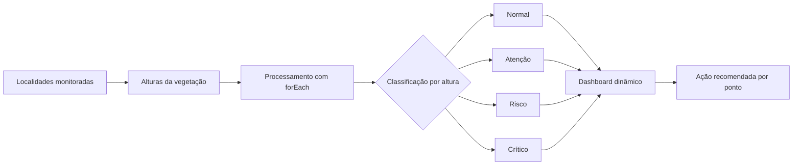

# GreenWatch — Sprint 3 de Application Development

## Integrantes

| Integrante | RM |
| --- | ---: |
| João Victor Alves de Abreu | 564946 |
| Luiz Henrique Barbosa Dias | 562399 |
| Rodrigo Kenshin Viana Matayoshi | 564026 |

### Monitoramento e classificação automática da vegetação em trechos rodoviários

O **GreenWatch** é uma aplicação web de apoio ao monitoramento ambiental. Nesta Sprint, a solução evolui o trabalho desenvolvido anteriormente e passa a classificar automaticamente a condição da vegetação com base em sua altura, indicando o nível de atenção e a ação operacional recomendada para cada localidade.

## Demonstração online

**[Acessar o GreenWatch — Sprint 3](https://joaovictoraabreu-dev.github.io/Fiap-sprint03--application-development/)**

O ambiente publicado utiliza a branch `sprint-03` e pode ser usado para demonstrar o dashboard, o mapa, o sensoriamento e os alertas durante a gravação do vídeo Pitch.

| Informação acadêmica | Detalhes |
| --- | --- |
| Curso | 2º ano de Ciência da Computação |
| Disciplina | Application Development |
| Professor | Allan Roberto Molto |
| Período | 2º semestre — Sprint 3 |
| Valor da entrega | 10,0 pontos |

## Sumário

- [Demonstração online](#demonstração-online)
- [Objetivo da Sprint](#objetivo-da-sprint)
- [Funcionalidades entregues](#funcionalidades-entregues)
- [Regras de classificação](#regras-de-classificação)
- [Fluxo da solução](#fluxo-da-solução)
- [Atendimento aos critérios de avaliação](#atendimento-aos-critérios-de-avaliação)
- [Arquitetura e organização](#arquitetura-e-organização)
- [Tecnologias utilizadas](#tecnologias-utilizadas)
- [Como executar](#como-executar)
- [Qualidade e validação](#qualidade-e-validação)
- [Vídeo Pitch](#vídeo-pitch)
- [Integrantes](#integrantes)

## Objetivo da Sprint

O objetivo da Sprint 3 é acrescentar recursos de **análise e classificação automática das condições da vegetação** monitorada ao longo das rodovias.

A aplicação recebe ou utiliza dados de altura, processa cada ponto conforme faixas de risco previamente definidas e apresenta no dashboard as quatro informações obrigatórias:

> **Localização | Altura da vegetação | Classificação | Ação recomendada**

Além da classificação por altura, a aplicação preserva as funcionalidades complementares de mapa, dados climáticos, alertas e indicadores executivos.

## Funcionalidades entregues

- classificação automática da vegetação conforme a altura registrada;
- array de objetos com faixas, classificações e ações recomendadas;
- processamento dos pontos monitorados com funções JavaScript/TypeScript e `forEach()`;
- uso de estruturas condicionais para determinar a situação de cada ponto;
- criação dinâmica das linhas da tabela por meio de componentes React;
- apresentação de localização, altura, classificação e ação recomendada;
- identificação visual por cores para os níveis Normal, Atenção, Risco e Crítico;
- indicadores resumidos de altura média e quantidade de intervenções necessárias;
- consulta de até 10 localidades por meio do OpenStreetMap Nominatim;
- dados climáticos complementares obtidos pela Open-Meteo;
- funcionamento da classificação mesmo quando a API climática estiver indisponível;
- fallback local para manter os pontos monitorados quando a consulta de localidades falhar.

## Regras de classificação

As regras foram definidas pelo grupo de forma coerente com a proposta de monitoramento e estão centralizadas no array `VEGETATION_HEIGHT_BANDS`.

| Faixa de altura | Classificação | Interpretação | Ação recomendada |
| --- | --- | --- | --- |
| De 0 a 30 cm | **Normal** | Vegetação dentro da faixa segura | Manter o monitoramento de rotina |
| Acima de 30 até 50 cm | **Atenção** | Vegetação próxima do limite operacional | Aumentar a frequência de inspeção do ponto |
| Acima de 50 até 80 cm | **Risco** | Vegetação exige planejamento de manutenção | Programar o serviço de roçada |
| Acima de 80 cm | **Crítico** | Vegetação exige resposta prioritária | Realizar intervenção imediata e sinalizar a área |

Os limites de `30`, `50` e `80` centímetros pertencem, respectivamente, às classificações **Normal**, **Atenção** e **Risco**. A função de classificação rejeita alturas negativas, infinitas ou que não sejam numéricas.

### Identificação visual

| Classificação | Cor utilizada |
| --- | --- |
| Normal | Verde |
| Atenção | Amarelo |
| Risco | Laranja |
| Crítico | Vermelho |

> [!IMPORTANT]
> As alturas presentes no repositório formam uma massa de dados demonstrativa e determinística. Elas permitem validar toda a lógica da Sprint 3, mas não representam medições reais de campo. A estrutura foi preparada para que esses valores possam ser substituídos futuramente por dados de sensores ou de uma API.

## Fluxo da solução



O processamento principal segue estas etapas:

1. `sensingService` obtém as localidades monitoradas ou utiliza a lista de fallback.
2. `buildVegetationMonitoringPoints()` percorre as localidades com `forEach()` e associa uma altura a cada ponto.
3. `classifyVegetationHeight()` utiliza condicionais para selecionar a faixa correspondente.
4. Cada resultado recebe uma classificação e uma ação recomendada.
5. `VegetationMonitoringTable` cria dinamicamente as linhas da tabela no dashboard.
6. `VegetationClassificationBadge` aplica a classe visual correspondente ao nível encontrado.

## Atendimento aos critérios de avaliação

| Critério | Peso | Evidência implementada | Situação |
| --- | ---: | --- | --- |
| Implementação da lógica de classificação da vegetação | 3,0 | Array de faixas, condicionais, validação de entrada e testes dos limites | Concluído |
| JavaScript para manipulação dos dados e atualização dinâmica do dashboard | 2,5 | TypeScript compilado para JavaScript, `forEach()` e renderização dinâmica com React | Concluído |
| Localidades, altura, classificação e ação recomendada | 2,5 | Tabela completa no dashboard e na página de sensoriamento, com cores por nível | Concluído |
| Vídeo Pitch de 1 minuto no YouTube | 2,0 | Seção preparada para receber o link após a gravação | Em produção |
| **Total** | **10,0** |  |  |

### Evidências no código

| Arquivo | Responsabilidade |
| --- | --- |
| `src/shared/constants/vegetation-height-bands.ts` | Faixas de altura, classificações, ações e alturas demonstrativas |
| `src/shared/utils/vegetation-classification.util.ts` | Validação, condicionais, `forEach()` e montagem dos pontos classificados |
| `src/domain/entities/vegetation-monitoring.entity.ts` | Tipos do domínio de monitoramento da vegetação |
| `src/presentation/components/vegetation/vegetation-monitoring-table.tsx` | Tabela dinâmica com as quatro informações obrigatórias |
| `src/presentation/components/shared/vegetation-classification-badge.tsx` | Cores e estilos visuais das classificações |
| `src/presentation/pages/dashboard.page.tsx` | Indicadores e apresentação da classificação no dashboard |
| `tests/unit/vegetation-classification.util.test.ts` | Testes das faixas, entradas inválidas e ações recomendadas |

## Arquitetura e organização

O projeto utiliza uma organização em camadas para separar domínio, integrações, regras de processamento e interface.

```text
src/
├── app/                     # Roteamento e providers da aplicação
├── application/             # DTOs e mapeadores de dados externos
├── domain/                  # Entidades e tipos do domínio
├── infrastructure/          # Clientes HTTP e serviços de integração
├── presentation/
│   ├── components/          # Tabelas, badges, mapa e componentes compartilhados
│   ├── hooks/               # Consultas e gerenciamento de estado assíncrono
│   ├── layouts/             # Estrutura visual compartilhada
│   └── pages/               # Dashboard, mapa, sensoriamento e alertas
├── shared/
│   ├── constants/           # Faixas, localidades de fallback e chaves de consulta
│   └── utils/               # Classificação e cálculos auxiliares
└── styles/                  # Estilos globais

tests/
└── unit/                    # Testes automatizados
```

### Integrações externas

- **OpenStreetMap Nominatim:** consulta das localidades monitoradas;
- **Open-Meteo:** condições climáticas atuais por coordenada.

As informações climáticas são complementares. Se a Open-Meteo estiver lenta ou indisponível, o dashboard informa a falha e mantém a classificação da vegetação acessível.

## Tecnologias utilizadas

- React 19;
- TypeScript;
- Vite 8;
- React Router;
- TanStack Query;
- Tailwind CSS;
- Axios;
- Leaflet e React Leaflet;
- Vitest;
- ESLint.

O código-fonte utiliza TypeScript, que é compilado para JavaScript pelo Vite. A tipagem explícita protege as faixas, classificações e ações contra combinações inválidas durante o desenvolvimento.

## Como executar

### Pré-requisitos

- Node.js 22.12 ou superior, ou Node.js 20.19+;
- npm 10 ou superior.

### Instalação

```bash
git clone https://github.com/JoaoVictorAAbreu-Dev/fiap-application-development-sprint-02.git
cd fiap-application-development-sprint-02
git checkout sprint-03
npm ci
```

### Configuração

Linux ou macOS:

```bash
cp .env.example .env
```

Windows PowerShell:

```powershell
Copy-Item .env.example .env
```

### Ambiente de desenvolvimento

```bash
npm run dev
```

O Vite informará no terminal o endereço local da aplicação, normalmente `http://localhost:5173`.

## Scripts disponíveis

| Comando | Finalidade |
| --- | --- |
| `npm run dev` | Inicia o servidor local de desenvolvimento |
| `npm run test` | Executa todos os testes unitários uma vez |
| `npm run test:watch` | Executa os testes em modo de observação |
| `npm run typecheck` | Verifica os tipos TypeScript sem gerar arquivos |
| `npm run lint` | Executa a análise estática com tolerância zero para avisos |
| `npm run build` | Valida os tipos e gera o build de produção |
| `npm run preview` | Executa localmente o build já gerado |

## Qualidade e validação

Para validar a entrega completa:

```bash
npm run test
npm run typecheck
npm run lint
npm run build
npm audit
```

No estado atual da Sprint 3:

- **21 testes unitários aprovados** em 6 arquivos;
- verificação de tipos aprovada;
- lint aprovado sem avisos;
- build de produção concluído;
- auditoria npm sem vulnerabilidades conhecidas;
- dashboard validado em desktop e dispositivo móvel;
- estados de sucesso, carregamento e falha da API climática verificados.

## Vídeo Pitch

**Link do vídeo da Sprint 3: https://youtu.be/VlhCzEI9VtM** 

<!-- Substitua o texto acima pelo link público do vídeo da Sprint 3. -->

